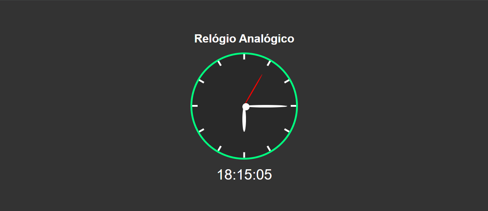

<h1 align="center"> Relógio Analógico </h1>

Relógio analógico desenvolvido para fins didáticos 

 

  

## 🚀 Tecnologias

Esse projeto foi desenvolvido com as seguintes tecnologias:

- HTML e CSS
- JavaScript
- Git e Github

## 💻 Projeto

Desenvolvido através das aulas da B7WEB com o professor Bonieky, para aprimoramento das habilidades em JavaScript.

## Créditos

Feito por Dário Klein && B7WEB ♥
